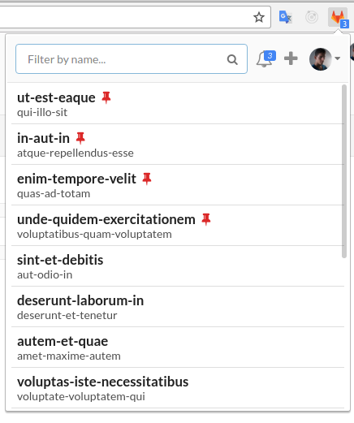
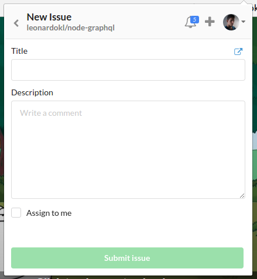
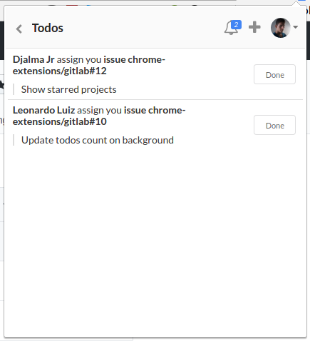
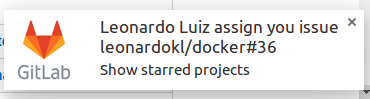

# GitLab Chrome Extension

Manage your GitLab projects and todos

<a target="_blank" href="https://chrome.google.com/webstore/detail/gitlab-manager-%CE%B2/adjbkadckkobnjhnljgpbaelndnagagm"></img></a>

## Features
  - Projects search
  - Create issues
  - Todos list
  - Todos notifications
  - Pin your projects to quickly access
  - Open this pages of a project: code, branches, issues
  - Copy to clipboard the recommended branch name of an issue
  - Configurable GitLab endpoint

