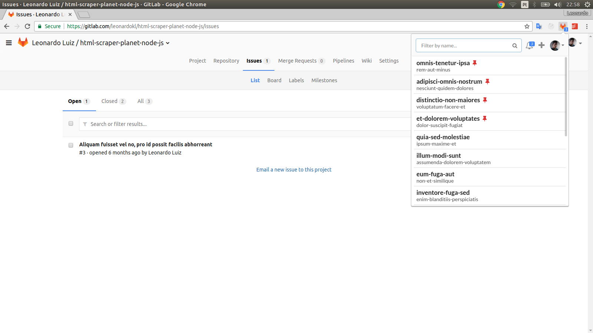
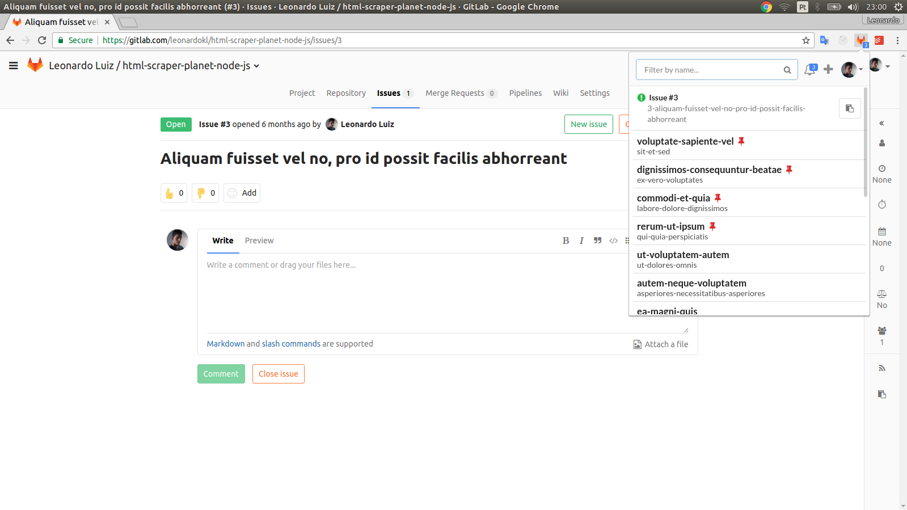

# Gitlab Chrome Extension

Quickly access all of your projects

## Features
  - Projects search
  - Create issues
  - Todos counter
  - Pin projects to quickly access then
  - Open this pages of a project: code, new issue, branches, issues
  - Copy to clipboard the recommended branch name of an issue

